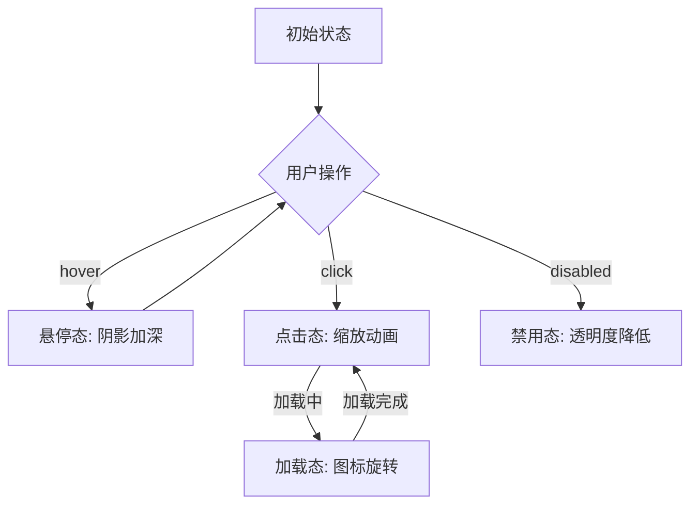

# 需求分析示例：[XQFX]按钮组件
## 用户调研摘要
- **核心痛点**：
    - 组件样式与业务设计语言适配成本高
    - 多端交互一致性难以保障（PC/移动端点击反馈差异）
    - 无障碍特性（如屏幕阅读器支持）缺失
- **期望功能**：
    - 支持主题化配置（颜色/尺寸/圆角）
    - 内置加载态/禁用态/危险态等多状态切换
    - 自定义图标与文本布局（左/右/上/下）
- **安全性需求**：
    - 防重复提交机制（点击防抖）
    - 敏感操作二次确认（危险按钮场景）

## 竞品对比报告
| 竞品        | 核心优势                  | 功能缺失点                |
|-------------|---------------------------|---------------------------|
| Ant Design  | 完整的API体系，支持自定义| 动态主题切换性能待优化    |
| Material-UI | 原生无障碍支持            | 尺寸适配移动端需额外配置  |
| Element UI  | 轻量化设计，文档完善      | 事件回调机制不够灵活      |

## 市场趋势分析
- **技术趋势**：
    - 基于CSS变量的动态主题方案（如Tailwind CSS）
    - 组件无感化设计（通过Composition API解耦逻辑）
- **用户需求趋势**：
    - 低代码场景下的可视化配置需求
    - 微前端架构下的组件沙箱隔离能力

# 功能点设计示例：[GNSJ]
## 功能描述
- **基础交互**：支持点击/聚焦/失去焦点事件，内置涟漪动画反馈
- **状态管理**：可通过props控制loading/disabled/error状态
- **样式定制**：支持自定义CSS类名、内联样式及主题变量覆盖

## API设计
### Props
| 名称       | 类型       | 默认值 | 说明                          |
|------------|------------|--------|-------------------------------|
| type       | string     | 'default' | 类型（default/primary/danger）|
| size       | string     | 'medium' | 尺寸（small/medium/large）    |
| icon       | string     | -      | 图标名称（需配合图标库使用）  |
| loading    | boolean    | false  | 加载状态标识                  |

### Events
| 名称       | 回调参数 | 说明                  |
|------------|----------|-----------------------|
| click      | event    | 点击事件              |
| focus      | event    | 聚焦事件              |
| blur       | event    | 失焦事件              |

## 交互关系

## 实现细节
- **状态切换**：通过CSS过渡实现0.3s平滑动画
- **无障碍**：自动添加`aria-pressed`和`role="button"`
- **性能优化**：事件委托处理批量按钮点击

## 用户操作流程
1. 初始化组件（设置type/size等属性）
2. 触发交互事件（点击/悬停）
3. 组件根据状态更新UI（如显示加载图标）
4. 事件回调返回操作结果

## 异常处理
- **无效type值**：自动降级为default类型
- **图标未加载**：显示默认占位符图标
- **重复点击**：通过debounce机制限制300ms内仅执行一次
